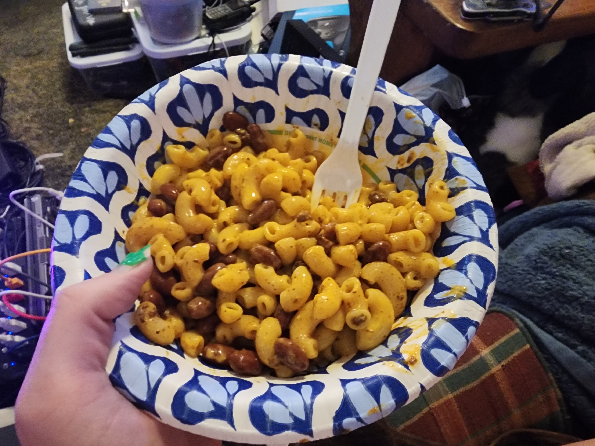

Chili Mac & Cheese

* One (1) box Kraft Deluxe original Cheddar Mac and cheese (must be cheese sauce or meal becomes too complicated) 

* One (1) can Chili Man Hot chili (I suppose you can use whatever canned chili you find) 

* Four (4) Drops of "Z.. Nothing Beyond Extreme Hot Sauce" note: this bottle is about 15 years old and the brand may not exist so just use something cheap with capsaicin extract

* One half (½) handful of Tillamook 4 cheese Mexican blend (I am autistic and brand loyalty is important but y'know find what you can) 

* Sugarfire Texas Hot BBQ sauce. This is a local brand so IDK I'm sure you can find hot and sweet bbq sauce

* Pretzel salt 

* Black pepper

  

Boil water in a soup pan with a sprinkle of pretzel salt. 

  

Dump canned chili into a pan and bring to boil. Rinse the chili can with a half can of water and add the chili water to the chili. Add four drops of capsaicin extract hot sauce. Allow to boil and then turn down to simmer, stirring to make sure it doesn't stick to the pan. Let reduce until manly. 

  

Dump pasta into water when it boils. Turn heat down to medium high so it doesn't boil over. Let pasta cook until hydrated to about 4mm tubes. Drain. 

  

Minding the chili while boiling the pasta should keep ADHD occupied. 

  

Drain pasta through screen. Put back in pan. Add black pepper and cheese sauce. Turn burner off and mix thoroughly on the burner while it cools. Lid up when not in use. 

  

Once chili is Sauce, fill paper bowl with 5/7ths of macaroni and cheese mixture. Top with two rows of chili sauce, as if you were laying out cocaine. Top with Mexican 4 cheese and a couple squirts of bbq sauce. Mix thoroughly. Cover chili sauce and leave heating on lowest temperature. Oyster crackers optional. Eat in quiet contemplation. Pair with diet Dr Pepper NOT Dr Pepper Zero Sugar!

