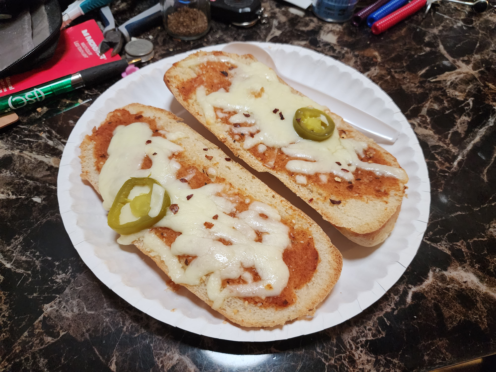

1. Gather two slices of a bread on a tray.
2. Paint with thin layer of pizza sauce. 
3. Add Parmesan, Romano and oregano.
4. Top with whole milk mozzarella or equivalent.
5. Add any spare fruits, vegetables and/or meats you have that are supported in the context of food.
6. Sprinkle with crushed red pepper.
7. Oven at 425F for 10 minutes or until cheese has browned slightly.
8. Pair with grape lemonade.

