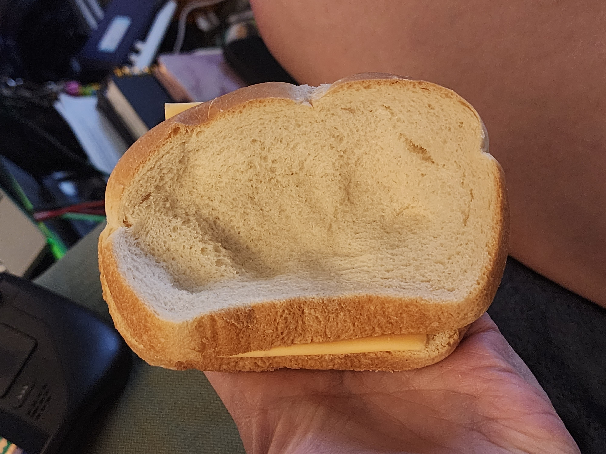

Pressed Cheese Sandwich

* 2x White bread
* American cheese slice
* Put cheese between bread slices.
* Lay sandwich on plate or other flat-ish surface and press firmly to flatten the sandwich
* Eat.

