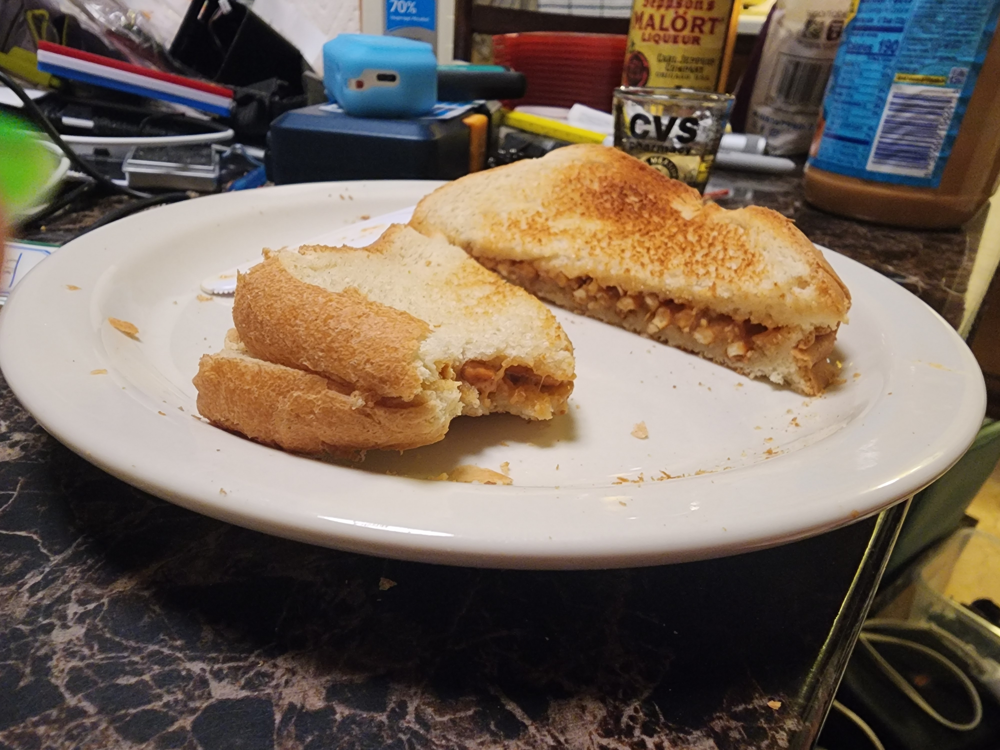

1. Toast a portion of white bread, I use two slices and a lighter toast.
2. Butter both halves.
3. Apply preferred peanut butter (I use creamy Skippy) to one half.
4. Arrange pretzel sticks side by side, covering the peanut butter side completely.
5. Close sandwich and slice along the diagonal bias.

